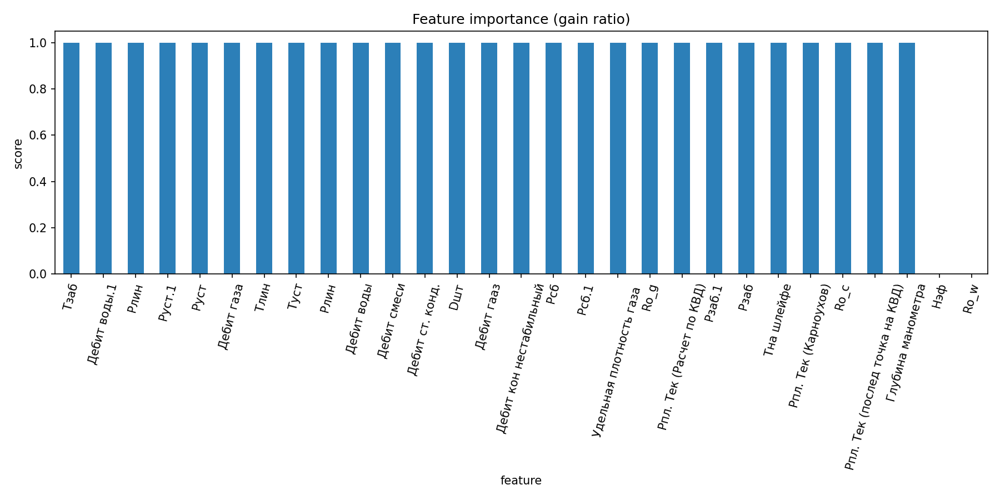
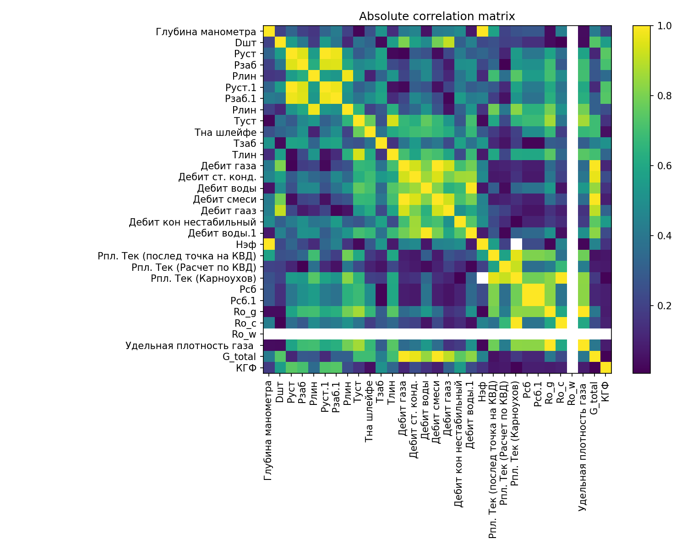

# Лабораторная работа 1. Работа с данными

## 1. Описание датасета
- Источник: ID_data_mass_18122012 (скважинные измерения)
- Размерность: 185 строк, 31 признак (после очистки метаданных)
- Целевые переменные: G_total, КГФ (23 непустых значения)

## 2. Очистка данных
- Удалены столбцы-метаданные (номер скважины, дата, дубликат КГФ.1)
- Строковые столбцы с десятичной запятой конвертированы в числовые
- Удалены строки, где оба таргета пусты

## 3. Анализ признаков

### 3.1. Gain ratio

Gain ratio (нормализованный информационный выигрыш) вычислен для каждого признака относительно обоих таргетов.

### 3.2. Корреляционная матрица

Выявлены пары признаков с |r| > 0.95 (мультиколлинеарность).

### 3.3. Распределения
Гистограммы с линиями Q1/Q3 для каждого числового признака сохранены в `assets/distributions/`.

### 3.4. Описательная статистика
Таблица с count, mean, std, min, 25%, 50%, 75%, max для всех признаков.

## 4. Отбор признаков

| Признак | Решение | Обоснование |
|---------|---------|-------------|
| ... | Оставить/Удалить | gain ratio / корреляция / пропуски |

## 5. Выводы
- Датасет содержит малое количество целевых значений (23 из 185)
- Gain ratio выделяет наиболее информативные признаки
- Мультиколлинеарные пары обработаны: оставлен более информативный признак
