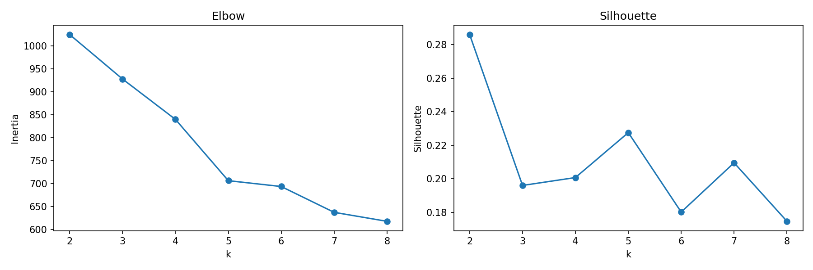
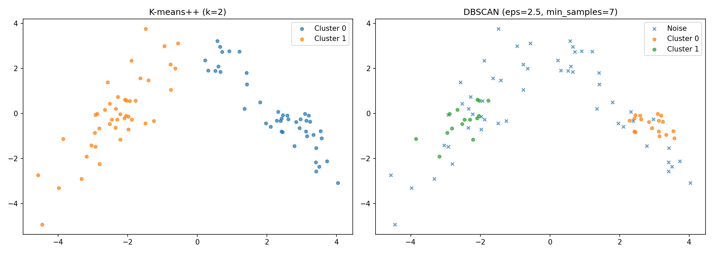

# Лабораторная работа 2. Кластеризация

## 1. Описание датасета
- Источник: Chemical Composition of Ceramic Samples (UCI 583)
- Признаки: 16 химических элементов (Na2O, MgO, Al2O3, ...)
- Псевдо-метки: Part (Body/Glaze) для внешней оценки

## 2. Предметная область и метрика
- Задача: определение групп керамических образцов по химическому составу
- **Silhouette Score** (внутренняя): компактность и разделимость кластеров
- **Adjusted Rand Index** (внешняя): сравнение с Part (Body/Glaze)

## 3. Предобработка
- Стандартизация (z-score) из-за разных масштабов (weight-% vs ppm)
- Обработка пропусков и пробелов в числовых столбцах

## 4. K-means++

### 4.1. Описание алгоритма
D²-взвешенная инициализация центроидов, итеративное присваивание и пересчёт.

### 4.2. Выбор k

### 4.3. Результаты
Silhouette = ..., ARI = ...

## 5. DBSCAN

### 5.1. Описание алгоритма
Плотностная кластеризация: точка ядра имеет >= min_samples соседей в eps-окрестности.

### 5.2. Подбор параметров (eps, min_samples)
Grid search по silhouette score.

### 5.3. Результаты
Silhouette = ..., ARI = ...

## 6. Визуализация

PCA-проекция на 2 компоненты (ручная реализация через собственные векторы ковариационной матрицы).

## 7. Сравнение

| Алгоритм | Кластеров | Silhouette | ARI |
|----------|-----------|------------|-----|
| K-means++ | ... | ... | ... |
| DBSCAN | ... | ... | ... |

## 8. Выводы
