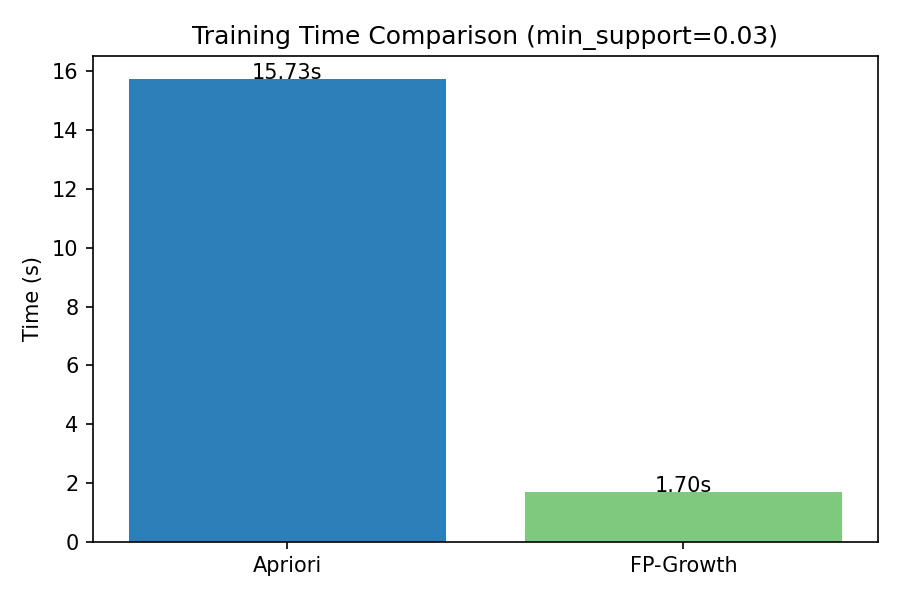

# Лабораторная работа 3. Ассоциативные правила

## 1. Описание датасета
- Источник: Online Retail (UCI 352)
- Транзакции: InvoiceNo → набор товаров (Description)
- Предобработка: фильтрация отменённых заказов, пустых описаний, отрицательных количеств

## 2. Apriori

### 2.1. Описание алгоритма
Итеративная генерация кандидатов с прунингом по свойству антимонотонности поддержки.

### 2.2. Параметры
- min_support = ...

### 2.3. Результаты
Количество частых наборов по уровням (k=1, 2, 3, ...).

## 3. FP-Growth

### 3.1. Описание алгоритма
Построение FP-дерева и рекурсивный майнинг условных паттернов.

### 3.2. Результаты
Верификация: FP-Growth и Apriori дают идентичные наборы.

## 4. Сравнение производительности

| Алгоритм | Время (с) | Частых наборов |
|----------|-----------|----------------|
| Apriori | ... | ... |
| FP-Growth | ... | ... |

## 5. Генерация правил
- min_confidence = ...
- Метрики: support, confidence, lift
- Топ-20 правил по lift

## 6. Рекомендательная функция
Функция `recommend(basket)` находит правила, чей антецедент является подмножеством корзины, и возвращает топ рекомендаций по confidence.

## 7. Выводы
