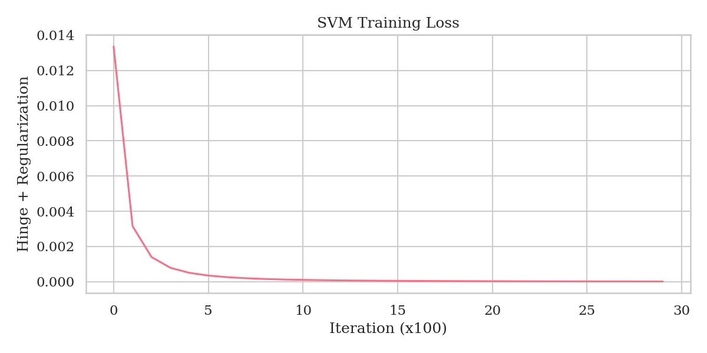
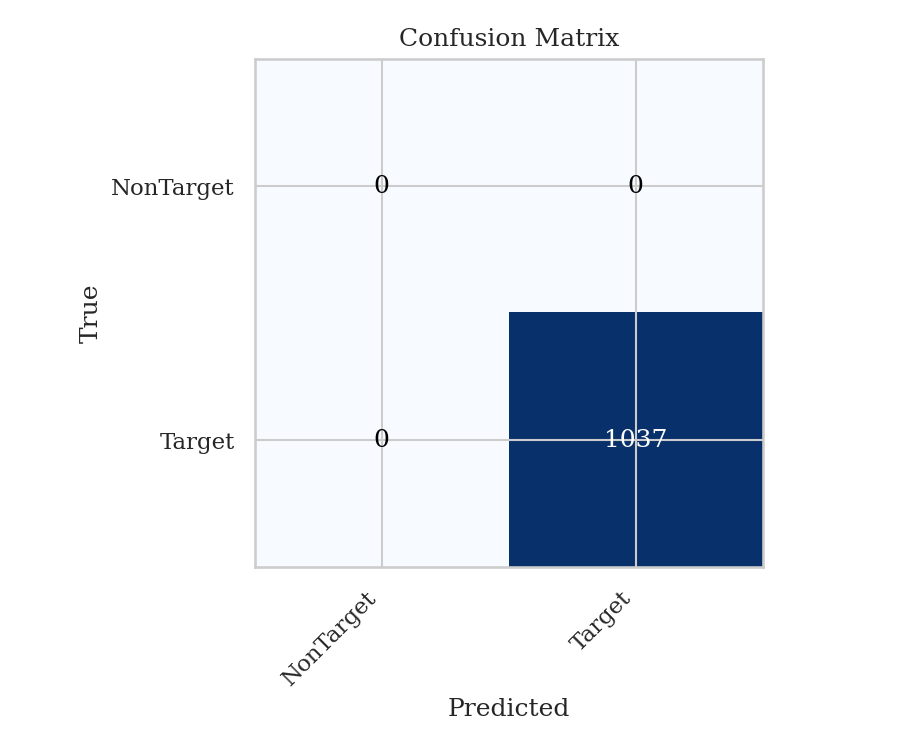
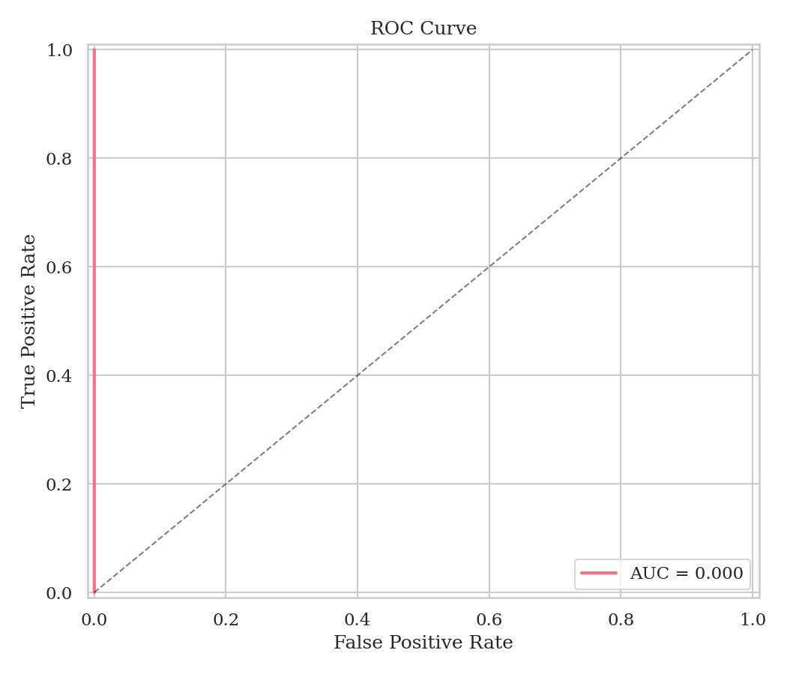

# Лабораторная работа 4. Машины опорных векторов

## 1. Цель
Классификация потенциала P300 в данных EEG (BCI).

## 2. Датасет
- Источник: MOABB BNCI2014009
- 16 EEG-каналов, 256 Гц
- Классы: Target (P300) / NonTarget, соотношение 1:5
- Использовано N субъектов

## 3. Анализ данных и детекция признаков
- Извлечение эпох 0-800 мс через MNE (предобработка, не моделирование)
- Признаки: средняя амплитуда в 5 временных окнах × 16 каналов = 80 признаков
- Undersampling NonTarget до 2:1

## 4. Метод
- **Линейная SVM** (Pegasos — стохастический субградиентный спуск на hinge loss)
- Обоснование линейного ядра: высокая размерность ERP-признаков
- Гиперпараметры: C=..., max_iter=...

## 5. Результаты

| Метрика | Значение |
|---------|----------|
| Accuracy | ... |
| Precision | ... |
| Recall | ... |
| F1-score | ... |
| AUC | ... |

## 6. Выводы
