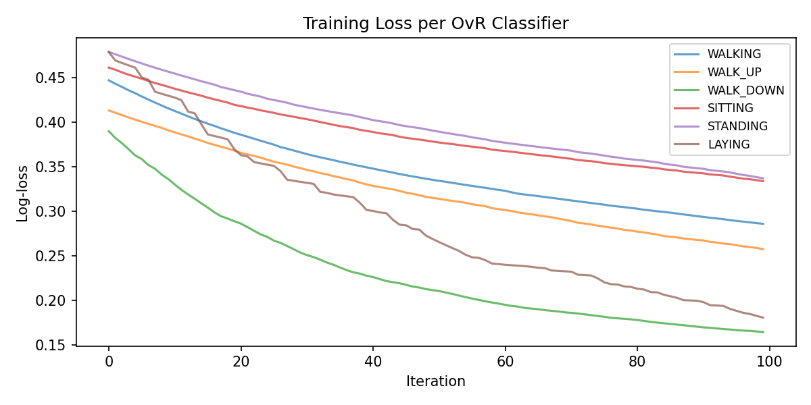
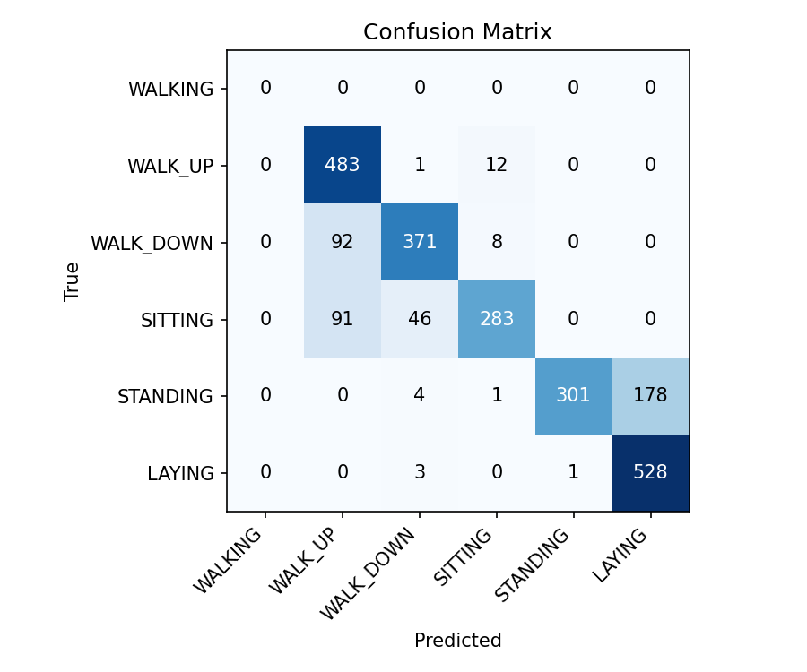
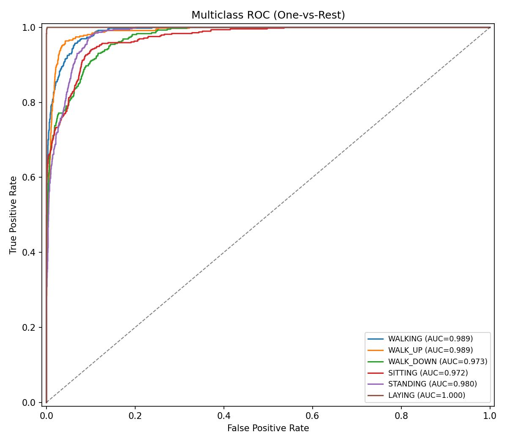

# Лабораторная работа 5. Градиентный бустинг

## 1. Цель
Распознавание человеческой активности по данным акселерометра и гироскопа.

## 2. Датасет
- Источник: UCI HAR (Human Activity Recognition Using Smartphones)
- 561 предвычисленный признак (time/frequency domain)
- 6 классов: WALKING, WALKING_UPSTAIRS, WALKING_DOWNSTAIRS, SITTING, STANDING, LAYING
- 7352 train / 2947 test

## 3. Метод
- **Градиентный бустинг** на решающих пнях (decision stumps)
- Функция потерь: log-loss (бинарная кросс-энтропия)
- Мультиклассовая стратегия: One-vs-Rest (6 классификаторов)
- Гиперпараметры:
  - n_estimators = ...
  - learning_rate = ...
  - max_features = sqrt(561) ≈ 24

### Обоснование гиперпараметров
- learning_rate=0.1 предотвращает переобучение
- Feature subsampling снижает корреляцию между деревьями
- 100 итераций достаточно для сходимости на HAR

## 4. Результаты

| Метрика | Значение |
|---------|----------|
| Accuracy | ... |
| Precision (macro) | ... |
| Recall (macro) | ... |
| F1 (macro) | ... |

## 5. Выводы
