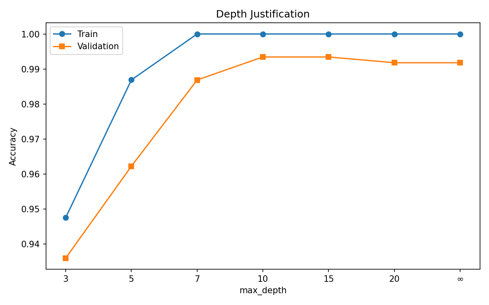
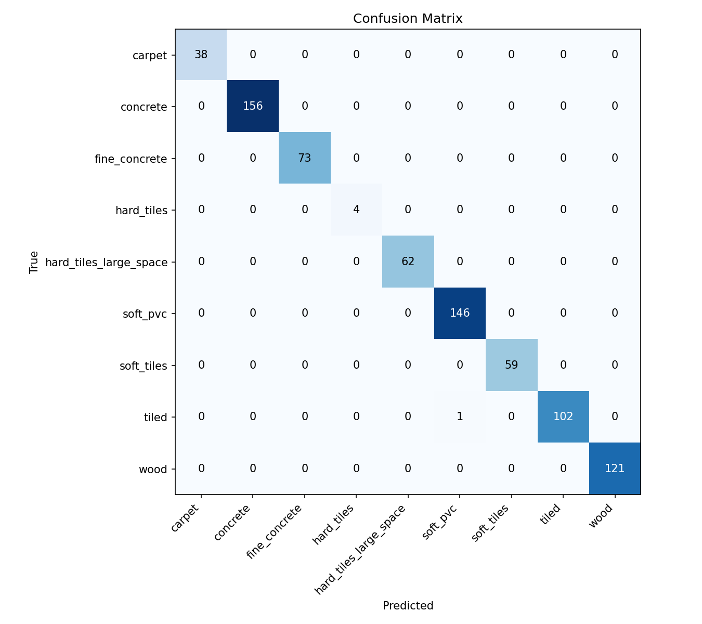
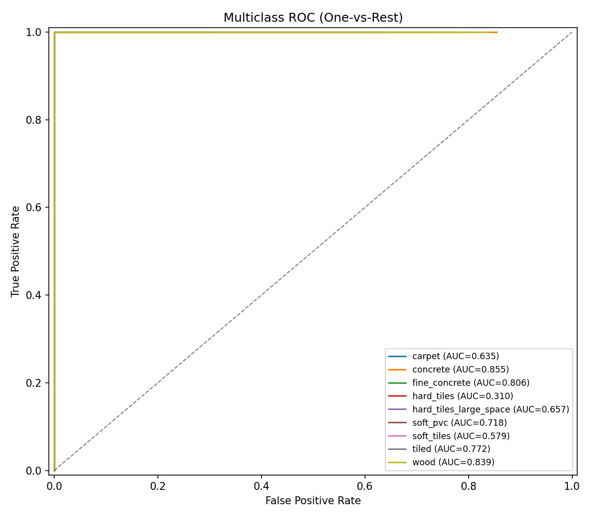

# Лабораторная работа 6. Random Forest

## 1. Цель
Классификация типов поверхности по данным IMU-сенсоров робота.

## 2. Датасет
- Источник: CareerCon 2019 (Kaggle)
- 3810 серий × 128 временных шагов × 10 сенсорных каналов
- 9 классов поверхности
- Признаки после агрегации: 80 числовых + group_id (категориальный) = 81

## 3. Предобработка
- Агрегация временных рядов: mean, std, min, max, range, median, q25, q75 по каждому каналу
- group_id сохранён как категориальный для не-бинарных разбиений
- Стратифицированное разбиение 80/20

## 4. Алгоритм

### 4.1. Дерево решений
- **Не-бинарное**: категориальные признаки → N-way split (один потомок на значение)
- **Не-сбалансированное**: глубина ветвей зависит от данных
- Числовые признаки → бинарный split по порогу
- Критерий: information gain (entropy)

### 4.2. Random Forest
- N деревьев на bootstrap-выборках
- Случайный выбор sqrt(n) признаков на каждом узле
- Предсказание: усреднение вероятностей

### 4.3. Обоснование глубины

Эксперимент: accuracy vs max_depth. Выбрана глубина X — валидационная accuracy перестаёт расти.

## 5. Результаты

| Метрика | Значение |
|---------|----------|
| Accuracy | ... |
| Precision (macro) | ... |
| Recall (macro) | ... |
| F1 (macro) | ... |

## 6. Выводы
