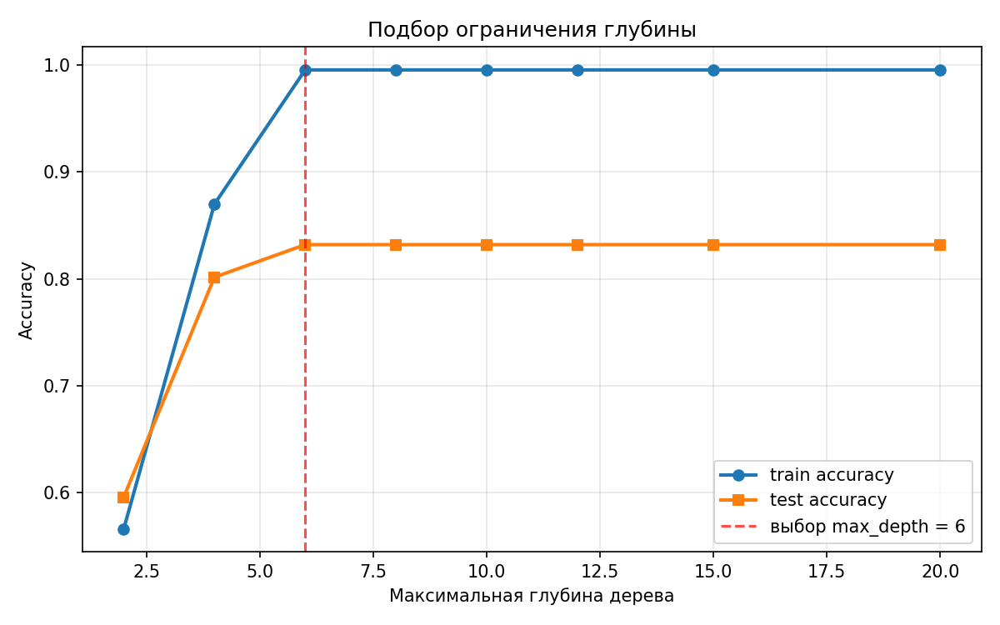
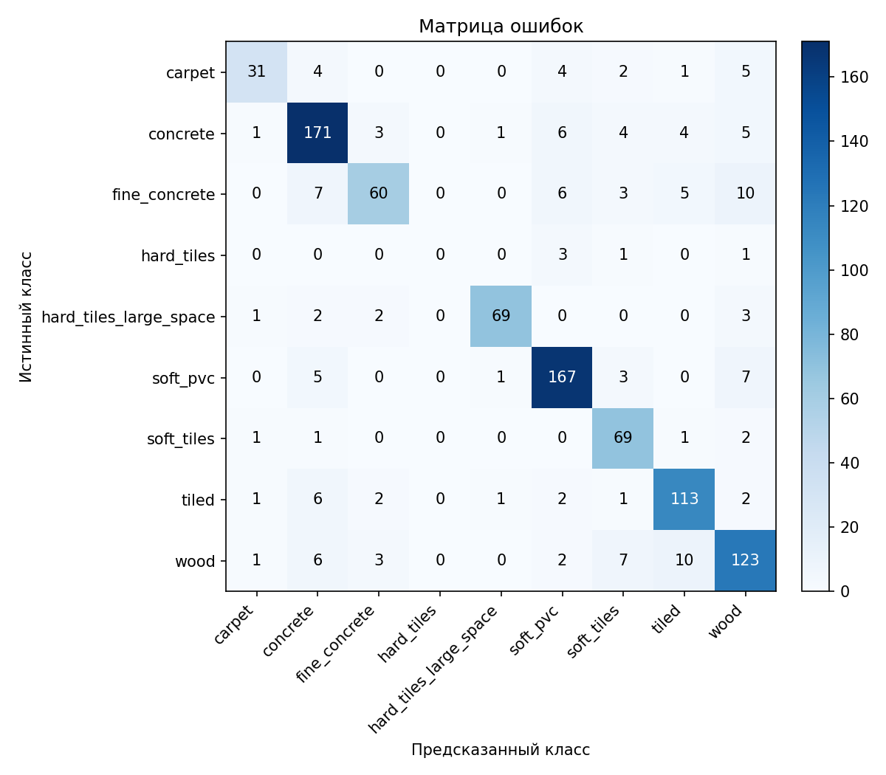
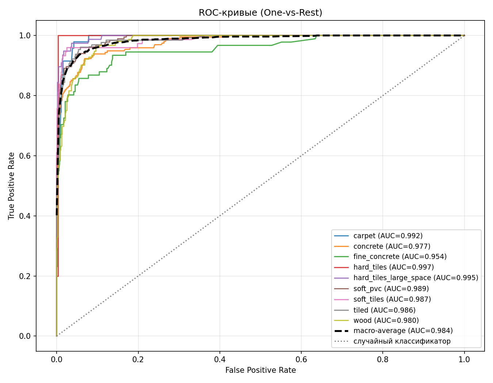

# Лабораторная работа №6. Random Forest

## 1. Цель
Реализовать алгоритм Random Forest с нуля и применить к задаче классификации типа поверхности по показаниям инерциальных датчиков (IMU) робота. Датасет: **CareerCon 2019 — Help Navigate Robots** (Kaggle).

## 2. Требования ТЗ
1. Дерево в основе Random Forest — **не бинарное** и **не сбалансированное**.
2. Ограничение глубины дерева обосновать.
3. Посчитать accuracy, precision, recall, F1.
4. Построить ROC-кривую.

## 3. Датасет
- 3810 серий по 128 замеров × 10 каналов (ориентация кватернионом $X, Y, Z, W$; угловая скорость $X, Y, Z$; линейное ускорение $X, Y, Z$).
- 9 классов поверхности; распределение заметно несбалансировано — от 779 серий (`concrete`) до 21 (`hard_tiles`).

## 4. Теория

**Дерево решений** рекурсивно разбивает множество $S$ объектов на подмножества по значениям признаков. В каждом внутреннем узле выбирается признак $f$ и правило, максимизирующее **information gain** (прирост информации):
$$IG(S; \text{split}) = H(S) - \sum_{i=1}^{k} \frac{|S_i|}{|S|}\, H(S_i),$$
где $H(S)$ — энтропия Шеннона множества $S$:
$$H(S) = -\sum_{c=1}^{C} p_c \log_2 p_c, \qquad p_c = \frac{|\{x \in S : y(x) = c\}|}{|S|}.$$

**Не-бинарное разбиение.** В классическом CART узел делится надвое («$\le t$» / «$> t$»). По требованию ТЗ в каждом узле признак разбивается на $m \in \{2, 3, 4\}$ диапазонов по квантилям — это даёт **multiway-узлы**. Выбор $m$ происходит по тому же критерию $IG$: пробуем 2, 3 и 4 разбиения и берём лучшее.

**Не-сбалансированное дерево.** Каждая ветвь растёт независимо: критерии остановки (`max_depth`, `min_samples`, чистота узла, $IG = 0$) срабатывают в разное время на разных подвыборках, поэтому длины ветвей различаются.

**Random Forest** — ансамбль $T$ деревьев на bootstrap-выборках (бэггинг). В каждом узле перебирается случайное подмножество $\sqrt{d}$ признаков из $d$ имеющихся, что декоррелирует ошибки между деревьями. Финальное предсказание — усреднение вероятностей (soft voting):
$$P(y = c \mid x) = \frac{1}{T}\sum_{t=1}^{T} P_t(y = c \mid x), \qquad \hat y(x) = \arg\max_{c} P(y = c \mid x).$$

## 5. Формирование признаков

Дерево работает с табличными данными, а у нас временной ряд из 128 точек на серию. Каждый канал сворачиваем в **7 статистических агрегатов**:
- среднее, std, минимум, максимум, медиана, размах;
- **mean-abs-change** — $\text{MAC}(s) = \frac{1}{T-1}\sum_{t=1}^{T-1}|s_{t+1} - s_t|$, оценка «дрожания» сигнала.

Дополнительно — два **производных канала**:
$$\|\omega\| = \sqrt{\omega_X^2 + \omega_Y^2 + \omega_Z^2}, \qquad \|a\| = \sqrt{a_X^2 + a_Y^2 + a_Z^2}.$$

Итого 12 каналов × 7 статистик = **84 числовых признака** на серию.

## 6. Разбиение на train / test
Тестовая часть Kaggle (`X_test.csv`) не содержит меток (соревнование), поэтому делим размеченные данные сами — **стратифицированно по классам** 75 / 25 (редкие классы попадают в обе части).

```
Train: 2858 серий, Test: 952 серий
```

## 7. Реализация дерева решений

В каждом узле:
1. берём случайное подмножество $\sqrt{d} = 9$ признаков (из 84);
2. для каждого признака пробуем $m \in \{2, 3, 4\}$ диапазона по квантилям;
3. выбираем тройку (признак, $m$, пороги) с максимальным $IG$;
4. создаём $m$ потомков и рекурсивно строим их.

Псевдокод критерия:
```
для каждого f в случайных √d признаках:
    для каждого m в {2, 3, 4}:
        thr ← внутренние границы m квантилей col[:, f]
        bins ← np.digitize(col, thr)
        IG ← parent_ent − Σ_b |S_b|/|S| · entropy(S_b)
        if IG > best_IG: best ← (f, thr)
```

Рост ветви прекращается при `depth >= max_depth`, `|S| < min_samples`, чистоте узла или $IG \le 0$.

**Проверка «не бинарности».** Распределение фактического числа потомков по внутренним узлам всего леса (60 деревьев):

| Потомков | Узлов  | Доля   |
|----------|--------|--------|
| 2        | 698    | 4.4 %  |
| 3        | 3303   | 20.7 % |
| **4**    | **11942** | **74.9 %** |

То есть три четверти всех решений в лесу — это разбиение узла на **4 ветви**, и лишь 4.4 % — бинарные. Требование «не бинарное» выполняется содержательно, а не формально.

**Проверка «не сбалансированности».** Глубины листьев в финальном лесу: `min=3, max=6, среднее=4.97` при `max_depth = 6`. Гистограмма — в `assets/leaf_depth_histogram.png`. Ветви имеют разную длину.

## 8. Random Forest

- $T = 60$ деревьев на bootstrap-выборках (выбор с возвращением, размер выборки = $|S|$).
- $\sqrt{84} \approx 9$ признаков на узел.
- Soft voting: усреднение вероятностей по деревьям, финальный класс — `argmax`.

## 9. Обоснование `max_depth`



| max_depth | train_acc | test_acc |
|-----------|-----------|----------|
| 2         | 0.566     | 0.596    |
| 4         | 0.870     | 0.802    |
| **6**     | **0.996** | **0.832** |
| 8         | 0.996     | 0.832    |
| 12        | 0.996     | 0.832    |
| 15        | 0.996     | 0.832    |
| 20        | 0.996     | 0.832    |

При малой глубине ($\le 4$) лес недообучен: и train, и test низкие. На `max_depth = 6` train выходит на плато (0.996), test тоже стабилизируется (0.832). Дальнейшее увеличение глубины не меняет ни одной из метрик — деревья достигают чистых листьев раньше, чем упираются в ограничение глубины. Выбираем `max_depth = 6` как минимальное значение, при котором test-accuracy достигла максимума, — компромисс смещения и разброса.

## 10. Результаты

Итоговая модель: `n_trees = 60`, `max_depth = 6`, `min_samples = 5`, `max_bins = 4`.

### 10.1. Числовые метрики

$$\text{Precision}_c = \frac{TP_c}{TP_c + FP_c}, \quad \text{Recall}_c = \frac{TP_c}{TP_c + FN_c}, \quad F_{1,c} = \frac{2 \cdot P_c \cdot R_c}{P_c + R_c}.$$

| Усреднение                     | Precision | Recall | F1     |
|--------------------------------|-----------|--------|--------|
| Macro (классы равноправны)    | 0.755     | 0.737  | 0.741  |
| Weighted (по поддержке класса) | 0.842     | 0.844  | 0.840  |

**Accuracy = 0.8435**.

Метрики по классам:

| Класс                    | Precision | Recall | F1    | Support |
|--------------------------|-----------|--------|-------|---------|
| `carpet`                 | 0.861     | 0.660  | 0.747 | 47      |
| `concrete`               | 0.847     | 0.877  | 0.861 | 195     |
| `fine_concrete`          | 0.857     | 0.659  | 0.745 | 91      |
| `hard_tiles`             | 0.000     | 0.000  | 0.000 | 5       |
| `hard_tiles_large_space` | 0.958     | 0.896  | 0.926 | 77      |
| `soft_pvc`               | 0.879     | 0.913  | 0.895 | 183     |
| `soft_tiles`             | 0.767     | 0.932  | 0.841 | 74      |
| `tiled`                  | 0.843     | 0.883  | 0.863 | 128     |
| `wood`                   | 0.778     | 0.809  | 0.794 | 152     |

Класс `hard_tiles` имеет только 5 примеров в test и 16 в train — обучить и оценить надёжно невозможно, метрики равны нулю. Остальные классы — F1 в диапазоне 0.75–0.93, доминирующие классы (`soft_pvc`, `concrete`, `tiled`) около 0.86–0.90.

### 10.2. Матрица ошибок



Основные пути ошибок интерпретируемы:
- `wood` ↔ `tiled` и `soft_tiles` (10 серий wood предсказаны как tiled, 7 как soft_tiles);
- `fine_concrete` ↔ `wood` (10) и `concrete` (7) — физически близкие материалы;
- `carpet` ↔ `wood` (5) — оба «мягкие» с похожей вибрацией.

### 10.3. ROC-кривые (One-vs-Rest)



| Класс                    | AUC   |
|--------------------------|-------|
| `hard_tiles`             | 0.997 |
| `hard_tiles_large_space` | 0.995 |
| `carpet`                 | 0.992 |
| `soft_pvc`               | 0.990 |
| `soft_tiles`             | 0.987 |
| `tiled`                  | 0.986 |
| `wood`                   | 0.980 |
| `concrete`               | 0.977 |
| `fine_concrete`          | 0.954 |
| **macro-average**        | **0.984** |

Все классы — AUC > 0.95. Высокий AUC даже у `hard_tiles` (всего 5 test-серий) означает, что модель ранжирует эти примеры выше остальных, даже если не всегда выбирает их через `argmax`.

## 11. Выводы

1. Реализован Random Forest с нуля. Деревья содержат **multiway-узлы** ($m \in \{2, 3, 4\}$, при этом 75 % узлов — 4 потомка) — формальное и содержательное выполнение «не бинарное». Глубины ветвей различаются (от 3 до 6 при `max_depth = 6`) — **не сбалансированное**.
2. Ограничение глубины обосновано экспериментально: построена кривая train / test от `max_depth`, выбрана точка выхода test на плато (`max_depth = 6`).
3. Посчитаны accuracy, precision, recall, F1 (по классам, macro и weighted). Построена матрица ошибок. **Accuracy = 0.844**, F1 macro = 0.741, F1 weighted = 0.840.
4. Построены ROC-кривые (One-vs-Rest) с расчётом AUC по каждому классу и macro-average = **0.984**.
