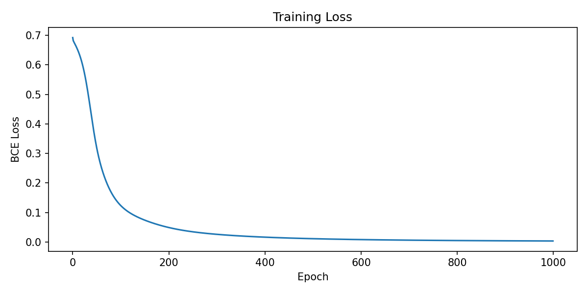
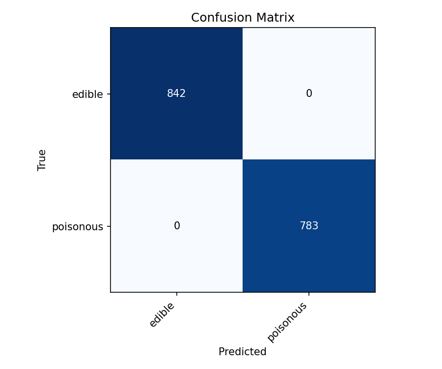
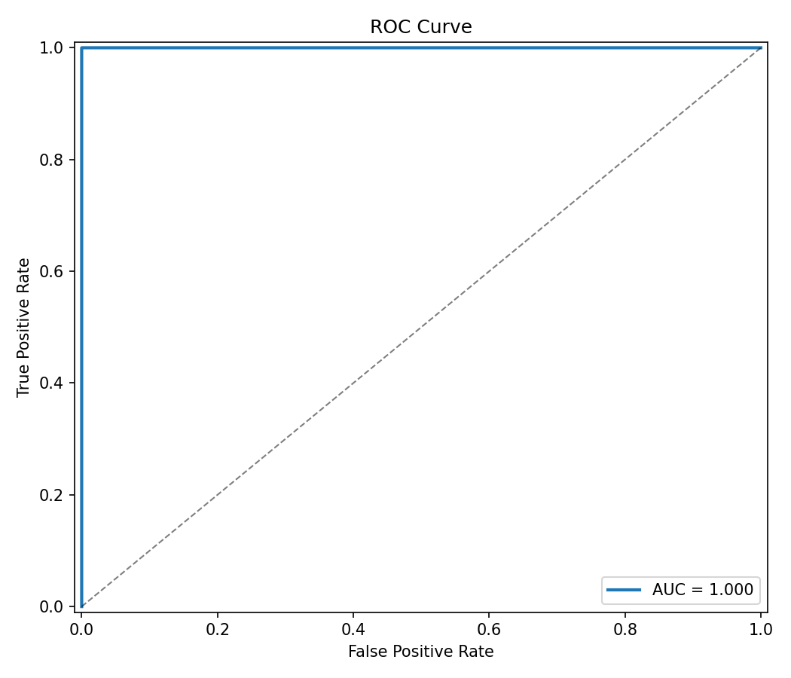

# Лабораторная работа 7. Многослойный персептрон (MLP)

## 1. Цель
Классификация грибов (съедобные/ядовитые) с помощью нейронной сети.

## 2. Датасет
- Источник: UCI Mushroom (id=73)
- 8124 образца, 22 категориальных признака (cap-shape, cap-color, odor, …)
- После one-hot: 117 бинарных входов
- 2 класса: edible (4208) и poisonous (3916), баланс примерно 52/48

## 3. Предобработка
- One-hot для всех 22 категориальных признаков → 117 бинарных входов. Без OH сетка интерпретировала бы строковые/целочисленные коды как порядковые, что некорректно.
- Единственный признак с пропусками — `stalk-root`: `ucimlrepo` отдаёт пропуски как `NaN` (литеральных `?` в загруженных данных нет, проверка `(X_raw == '?').sum()` возвращает пустой Series). При one-hot эти `NaN` становятся отдельной категорией со своим 0/1 столбцом, то есть пропуск трактуется как самостоятельное значение, а не отбрасывается.
- Стратифицированный split 80/20.

## 4. Архитектура MLP
- Вход: 117 нейронов
- Скрытый слой 1: 64 нейрона, сигмоида
- Скрытый слой 2: 32 нейрона, сигмоида
- Выход: 1 нейрон, сигмоида, даёт P(poisonous)

Один выходной нейрон с BCE проще двух с softmax: меньше параметров, для бинарной задачи результат тот же.

### 4.1. Обучение
- Функция потерь: binary cross-entropy
- Оптимизация: ванильный градиентный спуск, full-batch, без оптимизаторов
- Инициализация весов: Xavier (`std = sqrt(2 / (fan_in + fan_out))`)
- Learning rate: 0.5
- Эпох: 1000

В backward для выходного слоя использовал упрощение: при паре sigmoid + BCE производные сокращаются до `δ = ŷ − y`, это известный приём.

### 4.2. Кривая обучения

BCE-loss монотонно убывает на всём прогоне: с ≈0.69 на старте до ≈0.003 к 1000-й эпохе (0 → 0.0490 → 0.0163 → 0.0081 → 0.0049 на эпохах 0/200/400/600/800). Full-batch градиентный спуск с `lr=0.5` и Xavier-инициализацией сходится устойчиво, без скачков и расхождения, поэтому дополнительная регуляризация (weight decay, ранний останов) не требуется.

## 5. Результаты

| Метрика | Значение |
|---------|----------|
| Accuracy | 1.000 |
| Precision | 1.000 |
| Recall | 1.000 |
| F1-score | 1.000 |
| AUC | 0.9996 |

Все 1625 тестовых примеров классифицированы правильно при пороге 0.5. AUC ниже 1.0, потому что вероятности не строго 0/1, есть граничные случаи, и при некоторых порогах появляется FP. AUC 0.9996 показывает почти идеальное разделение.

## 6. Выводы

MLP с двумя скрытыми слоями на сигмоиде и BCE достаточно для классификации грибов. Один признак `odor` практически детерминирует класс, поэтому датасет считается «слишком простым», и сеть быстро выходит на 100% accuracy. Xavier-инициализация и `lr=0.5` дали стабильное обучение без оптимизаторов: BCE-loss монотонно убывает (≈0.69 → ≈0.003 за 1000 эпох), full-batch GD сходится устойчиво, дополнительная регуляризация не требуется.
